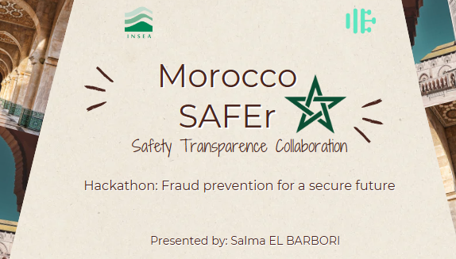
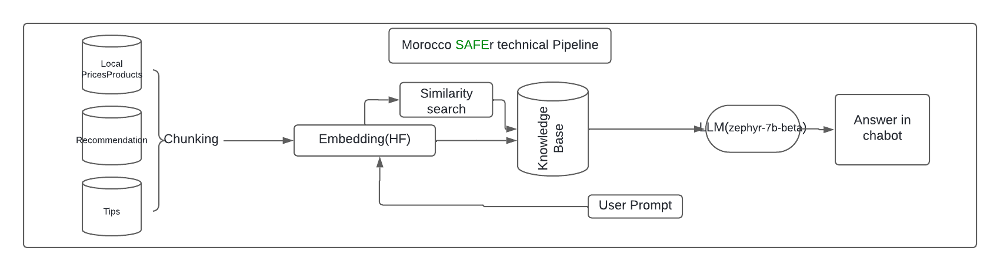
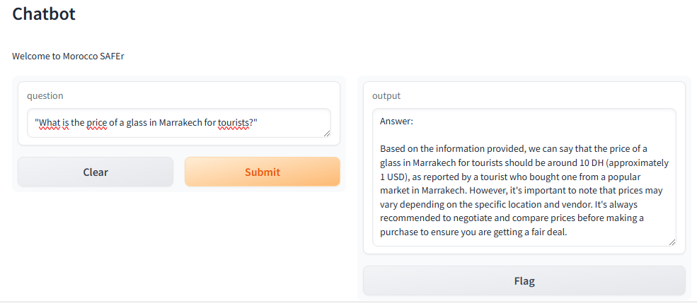

# Project Name

Morocco SAFEr, is a project born  during my participation in INSEA AI Hackathon focusing on Fraud prevension to secure future, I am submitting this project that is dedicated to the same matter, and more precisely applied in tourism sector, since I consider it a pilalr in the Moroccan Context.

<p align="center">
  
</p>


## Introduction

Our collaborative platform aims to enhance tourist security during their stay in Morocco, by preventing them from any type of fraud. This leads to securing the future of tourism as a leading sector to Morocco’s competitiveness.

## Dataset

The dataset for Morocco SAFEr contains different scenarios in form of title, category , questions and answer. It forms a knowledge base for the first version of the project.

## Pipeine for the project


## Working demonstration


## Presentation

Link for the presentation: 
- https://github.com/salmaelbarbori/HAKCATHONAIINSEA/blob/main/presentation/Morocco%20SAFEr.pptx


## Installation

```bash
pip install -r requirements.txt

## Acknowledgment

I would like to thank the Insea Innovation Club for giving me the opportunity to develop a meaningful project and contribute to the betterment of Morocco.